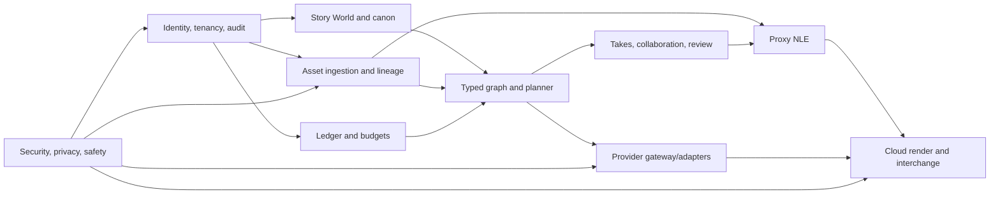

# Delivery, Reliability, Capacity, and Cost Plan

**Status:** Execution baseline  
**Version:** 1.0  
**Last updated:** 2026-07-06

## 1. Delivery philosophy

CineForge is not a disposable MVP, but it must still ship in controlled production slices. The correct unit of progress is an end-to-end creative outcome with security, billing, evidence, and recovery—not a collection of disconnected screens.

Each stage must:

- Use the final project/canon/graph/asset/run/ledger concepts.
- Include migrations, observability, runbooks, and security controls.
- Work for a narrow cohort under explicit limits.
- Produce evidence that justifies the next investment.
- Avoid preview-provider dependencies without a launch gate or fallback.

## 2. Recommended team shape

A credible initial product team is approximately 12–17 people, with some fractional specialists:

- Product lead/founder and product manager.
- Product designer with complex creative-tool experience.
- 3–4 web engineers, including canvas/timeline depth.
- 3 Go/platform engineers, including workflow/billing depth.
- 2 media engineers with FFmpeg, codecs, color, and interchange experience.
- 1 applied AI/evaluation engineer.
- 1 infrastructure/SRE engineer, growing to 2 before GA.
- 1 security engineer or strong fractional security lead from foundation stage.
- Trust and safety operations/policy ownership before external generation access.
- QA/automation ownership embedded initially, dedicated before paid beta.
- Developer relations/templates and customer success as cohorts expand.

Trying to build Story World, graph execution, collaboration, a full NLE, provider integrations, and a secure paid platform with a tiny generalist team would convert schedule risk into reliability and security debt.

## 3. Staged delivery

Durations are planning ranges, not commitments. Stage gates matter more than calendar dates.

### Stage 0 — Foundation and validation (8–12 weeks)

Deliver:

- Repository/CI/IaC/environment foundation.
- Identity, workspace, project, RBAC, audit skeleton.
- Core relational schemas and immutable asset ingestion.
- Provider capability and adapter contract with mock provider.
- Temporal proof for long-running generation and cancellation.
- Ledger proof for estimate/reserve/settle/reverse.
- Story World and Canon Snapshot domain prototype.
- Browser graph and timeline performance prototypes using representative project sizes.
- Threat model, approved-provider process, privacy/data map.

Gate:

- Architecture spikes prove graph interaction, proxy playback, durable job recovery, and tenant isolation.
- No unresolved decision about timing representation, run immutability, or billing semantics.

### Stage 1 — Creator production slice / private alpha (14–20 weeks)

Deliver:

- Creator Mode project setup and script/text intake.
- Entity/scene extraction with source citations and canon approval.
- Character/location reference sets.
- Typed canvas with text, story context, image, video, compare/select, and essential transforms.
- Initial Google text/image/video adapters behind model gateway.
- Asset lineage, run history, price estimate, credit reservation, and recovery.
- Shot/take model and simple storyboard projection.
- Single-user proxy timeline with core trim, tracks, captions, audio, and cloud render.
- Safety checks, rights declarations, reporting, and operator tooling.

Limits:

- Invite-only solo creators.
- Restricted models, project duration, storage, concurrency, and export presets.
- No contractual uptime claim.

Gate:

- Qualified users reach approved canon, three approved shots, and an exported cut.
- Run recovery and ledger reconciliation pass at alpha volume.
- No high-risk safety workflow depends on ad hoc database access.

### Stage 2 — Studio workflow / collaborative alpha (12–18 weeks)

Deliver:

- Studio Mode graph controls, subgraphs, batch/map, approvals, and templates.
- Live Yjs collaboration for Develop, canvas, and timeline.
- Roles, comments, review ranges, assignments, and named checkpoints.
- Continuity-in/out, stale-canon impact, and coverage checks.
- Expanded audio generation/processing and lip-sync where approved.
- Workspace budgets, provider policy, team usage views, and notifications.
- Hardened timeline model and replacement-take conform.

Gate:

- Teams complete concurrent edit/review exercises without lost acknowledged state.
- Cross-workspace collaboration and share-link tests pass.
- One team can produce and review a short sequence without external spreadsheets.

### Stage 3 — Full NLE and paid beta (16–24 weeks)

Deliver:

- Full launch NLE toolset from PRD-070–079.
- Proxy strategy, waveform/thumbnail tiling, nested sequences, effects, keyframes, mixer, caption workflow.
- Deterministic segmented cloud renderer and render cache.
- OTIO, FCPXML, EDL, media relink package, stems, and provenance report.
- Stripe subscriptions, invoicing integration, credits/usage UI, refunds and support tooling.
- 99.9%-target SLO instrumentation, backup restore, incident response, status communication.
- External penetration test and legal/policy launch package.

Gate:

- Paid design partners complete real projects and external NLE handoff.
- Gross margin is measurable per capability/workspace.
- Security, billing, render, deletion, and provider-outage exercises pass.

### Stage 4 — Multi-provider and GA hardening (12–20 weeks)

Deliver:

- First non-Google providers selected by customer value and unit economics.
- Full adapter conformance, provider register, workspace allow/deny policy.
- Model deprecation/migration UX and evaluation corpus.
- Capacity validation at year-one envelope.
- Fair scheduling, advanced cost controls, regional DR exercises.
- Support SLAs/runbooks, vulnerability disclosure, operational ownership.

Gate:

- GA acceptance conditions in the PRD are met.
- 99.9% control-plane SLO has been demonstrated over a representative period.
- No silent provider substitution or unreconciled material billing variance.

### Stage 5 — Expansion

Potential work, prioritized by evidence:

- EU regional data plane.
- Desktop shell/local media acceleration.
- Recurring Story Worlds across productions.
- Enterprise SSO/SCIM, advanced audit export, customer-managed keys.
- AAF/deeper round-trip.
- Reviewed workflow/model ecosystem or BYOK.
- Proprietary continuity evaluation or narrowly trained models.

## 4. Workstream dependencies



Security, observability, and cost accounting are continuous workstreams, not a final hardening phase.

## 5. Service-level objectives

SLOs apply only after GA unless a beta agreement states otherwise.

| Service indicator | GA objective | Measurement boundary |
|---|---:|---|
| Control-plane availability | 99.9% monthly | Valid authenticated API requests excluding planned exceptions |
| Acknowledged mutation durability | 99.95% | Mutations acknowledged then recoverable after service restart |
| Project read p95 | < 500 ms | Primary US region, normal project metadata, excluding media transfer |
| Collaborative update p95 | < 300 ms | Accepted update to peer receipt in primary region under target load |
| Run status propagation p95 | < 2 s | Durable state transition to connected client/event consumer |
| Generation orchestration success | 99.9% | Correctly handle/record provider outcome; excludes provider rejection/failure |
| Render orchestration success | 99.5% | Valid supported timeline reaches output or actionable deterministic failure |
| Ledger integrity | 100% | Settlements linked to run/render and balanced entries |
| Critical security-event triage | < 15 min | From alert to acknowledged incident during coverage |
| Supportable deletion completion | Published policy | Verified across active systems and provider requests |

### Error budgets

- Each SLO has a monthly error budget and owner.
- If a service exhausts 50% of its budget early in the window, pause risky feature rollout and review.
- At 100%, prioritize reliability work and require approval for non-remediation production changes.
- Provider availability is reported separately; CineForge is accountable for correct handling, transparency, and recovery.

## 6. Capacity model

### Planning envelope

- 10,000 monthly active users.
- 1,000 concurrent editing/review sessions.
- 300 concurrent connected collaboration documents during peaks, with room for multi-tab/device use.
- Generation submissions are bursty; provider-specific quotas are capacity inputs.
- Large projects may contain thousands of asset versions, hundreds of shots, and multi-hour source media even if generated final duration is shorter.

These are test scenarios, not claimed limits.

### Load profiles

1. **Solo evening burst:** high project creation and generation, modest collaboration.
2. **Team review:** many websocket connections, comments, proxy streams, few provider calls.
3. **Batch storyboard:** high fan-out image generation and thumbnail ingestion.
4. **Video/render burst:** long provider waits, large output transfers, heavy FFmpeg.
5. **Export deadline:** multiple 4K render requests and egress spikes.
6. **Provider incident:** retry pressure without increased useful throughput.

### Backpressure

- Reject or defer before provider submission, not after spending.
- Per-workspace and global concurrency, weighted fair queues, and plan-level fan-out caps.
- Separate queues for interactive generation, batch, proxy, and final render.
- Provider circuit breaker and quota-aware admission.
- Budget reservation and storage quota before work.
- Degrade preview quality/concurrency before compromising state durability or billing.

### Performance testing

- Synthetic CRDT clients with realistic document/update distributions.
- Graphs with 100, 1,000, and 10,000 nodes for view-layer thresholds; execution slices remain bounded.
- Timelines with nested sequences, variable-rate media, captions, effects, and long audio.
- Upload parser corpus including malformed and adversarial files.
- Temporal histories covering long waits, retries, cancellation, and version upgrades.
- Soak tests for connection churn, memory leaks, database pool saturation, and queue fairness.

## 7. Cost model

Do not hard-code volatile provider prices in architecture documents. Maintain a dated internal price book and scenario model.

### Cost equation

For workspace `w` in period `t`:

```text
COGS(w,t) = model_calls
          + media_compute
          + storage_capacity
          + storage_operations
          + CDN_and_egress
          + collaboration_runtime
          + workflow_and_database_share
          + payment_fees
          + moderation_and_support_variable_cost
          - provider_credits_or_refunds
```

Gross margin:

```text
GM(w,t) = (recognized_revenue(w,t) - COGS(w,t)) / recognized_revenue(w,t)
```

### Unit dimensions to retain

- Model/provider, capability, model version, quality tier.
- Input/output units, count, duration, resolution, and successful outputs.
- Worker vCPU/GPU seconds, memory GB-seconds, scratch GB-seconds.
- Stored byte-month by object class and age.
- Read/write/list operations, CDN bytes, origin/Internet egress.
- Render output minute by resolution/codec and render factor.
- Workspace/project/member attribution.

### Example scenario model

For each plan, model at least light/expected/heavy cohorts:

| Variable | Light solo | Expected solo | Expected team | Heavy team |
|---|---:|---:|---:|---:|
| Active projects/month | input | input | input | input |
| Image runs | input | input | input | input |
| Video seconds generated | input | input | input | input |
| Speech/music/SFX units | input | input | input | input |
| Stored GB and monthly growth | input | input | input | input |
| Proxy/render minutes | input | input | input | input |
| Egress GB | input | input | input | input |
| Seats | 1 | 1 | 2–10 | 2–10 |

Finance/product replace `input` with current observed distributions and provider price-book versions. Do not invent apparent precision before beta data exists.

### Pricing guardrails

- Estimate before reservation and show estimate expiry.
- Add a transparent platform margin; do not promise permanently fixed credits against variable supplier cost.
- Price failed, cancelled, cached, and partial runs according to documented delivered-value rules.
- Alert on provider price/currency changes and disable stale price books automatically.
- Require explicit approval when actual maximum can exceed estimate.
- Do not subsidize abusive retry loops; fix defects and refund through ledger entries.

## 8. FinOps controls

### Product controls

- Workspace monthly budget and per-run approval threshold.
- Member/project limits and concurrency.
- Draft/balanced/final quality policies.
- Predicted fan-out and storage before batch.
- Cost breakdown after completion.
- Anomaly and budget alerts.

### Platform controls

- Provider quotas and committed throughput only after utilization evidence.
- GCS lifecycle for temporary transfers, stale proxies, and expired exports.
- Content-addressed reuse for pure transforms and render segments.
- Cloud Run minimum instances only where cold-start SLO requires them.
- Rightsize database, collaboration, and worker pools using measured saturation.
- Separate cost attribution labels/accounts without placing customer content in labels.
- Daily provider/ledger reconciliation and weekly gross-margin review during beta.

### Cost kill switches

- Global/provider/capability submission pause.
- Workspace/member/project budget stop.
- Maximum batch cardinality and output count.
- Render resolution/concurrency restriction.
- Free-tier signup/generation throttling.

Kill switches stop new work safely; they do not corrupt in-flight workflows.

## 9. Reliability testing and exercises

### Automated

- Contract and property tests for graph types, rational timing, ledger balance, idempotency, and migrations.
- Adapter conformance with deterministic mock provider.
- Golden render tests for supported effects/codecs.
- CRDT convergence and restore tests.
- Authorization matrix and cross-tenant negative suite.
- Backup restore verification and asset/database reconciliation.
- Dependency failure injection around provider, storage, Pub/Sub, database, and Stripe.

### Game days

- Vertex/provider quota exhaustion and outage.
- Worker killed after provider completion but before asset ingestion.
- Duplicate/late callback after cancellation/refund.
- Collaboration gateway loss during concurrent timeline changes.
- Database failover and point-in-time restore.
- Corrupt render worker image or bad FFmpeg release.
- Signed URL leak and mass-download attempt.
- Provider credential compromise and rotation.
- Ledger/provider invoice mismatch.
- Primary-region outage and secondary-region recovery.

Each exercise records hypothesis, observed behavior, user impact, SLO consumption, evidence gaps, actions, owners, and deadlines.

## 10. Operational readiness checklist

Every production service/capability needs:

- Named product and engineering owners.
- SLO, dashboards, alerts, and error-budget policy.
- Capacity/quota and dependency map.
- Deployment, rollback, migration, and data-repair procedures.
- Security/data classification and threat model.
- Cost attribution and kill switch.
- User-facing errors and support diagnostic path.
- Incident runbook and recent exercise.
- Deprecation and data-deletion behavior.

## 11. Requirement traceability

| PRD area | Primary subsystem | Primary security control | Delivery stage | Main acceptance evidence |
|---|---|---|---:|---|
| PRD-001–007 workspace | Identity/control API | RBAC, MFA, tenant scope, audit | 0–2 | Authorization matrix, ownership recovery |
| PRD-010–019 Story World | Story/canon module | Source boundaries, publish permission | 1–2 | Canon diff/impact and citation tests |
| PRD-020–026 assets | Asset service/media workers | Quarantine, sandbox, scoped storage | 0–2 | Adversarial corpus, lineage reconstruction |
| PRD-030–042 graph | Graph planner/Temporal | Typed validation, signed registry, limits | 1–2 | Graph/property tests, worker-loss recovery |
| PRD-050–059 models | Provider gateway/adapters | Approved register, egress, secret isolation | 1–4 | Adapter conformance and provider outage game day |
| PRD-060–067 collaboration | Yjs gateway/review module | Channel auth, update limits, audit | 2 | Convergence, restore, cross-tenant tests |
| PRD-070–081 NLE | Client media engine/render workers | Sandboxing, manifest integrity | 1–3 | Golden renders, timing/interchange corpus |
| PRD-090–096 billing | Ledger/Stripe integration | Idempotency, balanced entries, reconciliation | 1–3 | Replay tests and invoice reconciliation |
| PRD-100–106 trust | Policy/ingestion/case operations | Moderation, consent, provenance, deletion | 0–3 | Policy evaluations and response exercises |

## 12. Top risks and mitigations

| Risk | Probability | Impact | Mitigation / trigger |
|---|---:|---:|---|
| Full NLE consumes the roadmap | High | High | Fixed launch subset, media specialists, interchange; reject unscoped finishing features |
| Provider change/deprecation | High | High | Aliases, snapshots, adapters, evaluation, migration UX |
| Provider cost destroys margin | Medium | High | Price book, reservation, per-capability margin, kill switches |
| Timeline/CRDT conflicts harm trust | Medium | High | Semantic operations, soft locks, checkpoints, convergence/load tests |
| Continuity claims exceed model reality | High | Medium | Define measurable continuity state; never promise perfection |
| Malicious media compromise | Medium | Critical | Quarantine, sandbox, egress isolation, patching, corpus tests |
| Safety/likeness incident | Medium | Critical | Consent, moderation, limits, provenance, response operations |
| Architecture over-fragments | Medium | High | Modular services first; split only by measured boundary |
| Google-first becomes lock-in | Medium | Medium | Provider-neutral contract and second adapter through conformance before GA |
| Solo UX becomes too technical | High | High | Guided compiler, templates, mode testing, activation research |
| Team UX becomes too simplistic | Medium | Medium | Studio Mode, approvals, graph depth, interchange |
| Regional/data-residency demand arrives early | Medium | Medium | Data classification and region-aware IDs now; complete EU plane later |

## 13. Decision checkpoints

- **After Stage 0:** continue XYFlow or start accelerated WebGL graph layer based on measured 1k/10k-node behavior.
- **After Creator alpha:** choose the first production activation flow using observed completion, not preference.
- **Before Stage 3:** validate that the NLE subset and interchange cover paid design partners; freeze launch scope.
- **Before adding a provider:** prove unique customer value, economics, legal/security approval, and conformance.
- **Before GKE:** show Cloud Run job limits or cost with production traces.
- **Before EU region:** confirm demand and fund a complete operational boundary.

These are evidence gates. The implementation path at each gate is already defined; the evidence determines whether the trigger condition is met.
