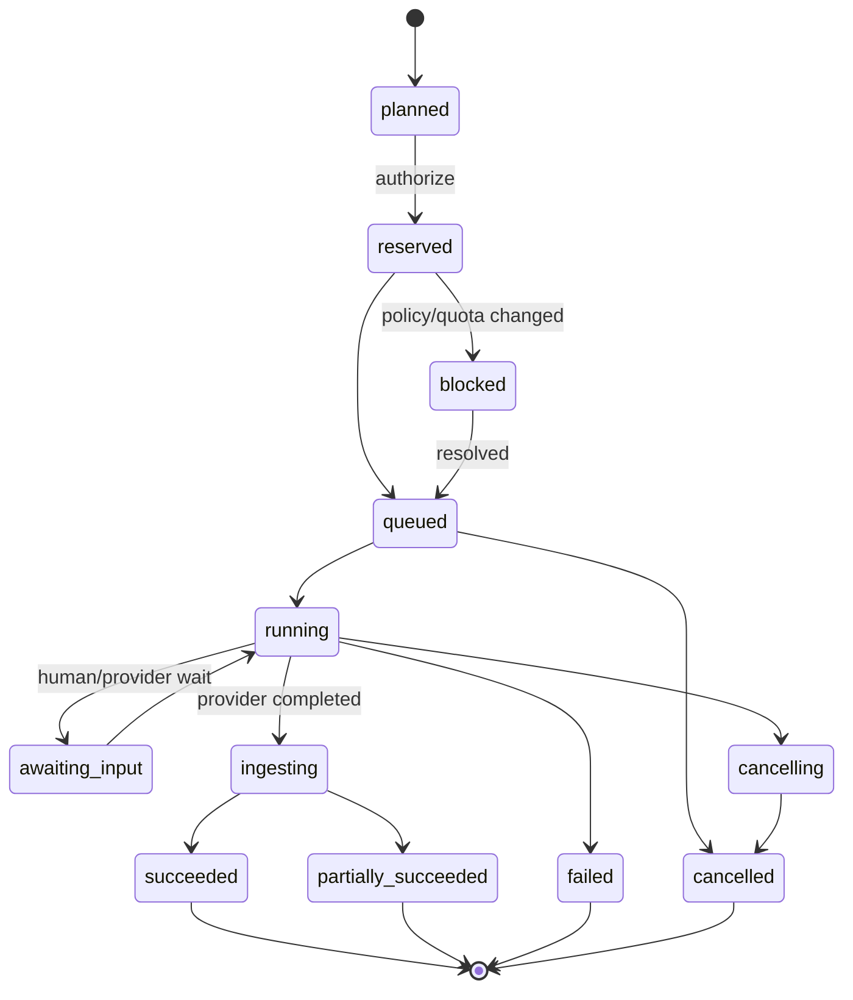

# Node and Workflow Specification

**Status:** Normative product-level contract  
**Version:** 1.0  
**Last updated:** 2026-07-06

## 1. Purpose

This document defines how CineForge represents, validates, executes, versions, and bills multimodal workflows. It is implementation-language neutral. Concrete APIs may add transport metadata but must preserve these semantics.

The graph serves three experiences:

- Creator Mode compiles guided production actions into graph operations.
- Studio Mode exposes the graph directly.
- Backend workers execute immutable graph/run snapshots.

Canvas coordinates, selection, collapsed state, and color are presentation metadata. They never determine execution or story order.

## 2. Design invariants

1. A run never reads mutable “latest” inputs after authorization.
2. Every billable run has one reservation and one terminal settlement or reversal.
3. A successful output is an immutable `AssetVersion`.
4. Connections are validated by declared types and constraints before execution.
5. Provider request/response shapes never leak into core project objects.
6. Provider/model fallback is explicit, policy-authorized, and recorded.
7. Canon is referenced by immutable snapshot ID.
8. Retrying cannot duplicate completed assets or charges.
9. A graph can be opened even when a provider/model is unavailable; only affected new runs are blocked.
10. User-created workflow definitions cannot execute arbitrary code in the hosted launch product.

## 3. Type system

### 3.1 Base port types

| Type | Meaning | Important constraints |
|---|---|---|
| `text` | UTF-8 text | language, max length, semantic role |
| `json<T>` | Versioned structured value | schema URI and version required |
| `number` | Integer or decimal | unit, min/max, precision |
| `boolean` | True/false | — |
| `image` | Raster asset reference | MIME, dimensions, alpha, color space |
| `mask` | Single-channel/alpha image reference | dimensions and coordinate space |
| `video` | Video asset reference | codec, dimensions, frame rate, duration, color metadata |
| `audio` | Audio asset reference | sample rate, channels, duration, loudness metadata |
| `subtitle` | Timed text asset | format, language, timebase |
| `mesh3d` | 3D asset reference | format, topology/material metadata |
| `reference<T>` | Stable entity/reference-set pointer | entity kind, snapshot, allowed usage |
| `timeline_segment` | Versioned timeline range | timeline version, timebase, range |
| `control` | Non-media execution signal | approval, selection, condition, trigger |
| `array<T>` | Ordered homogeneous collection | item type and bounded cardinality |

The storage value for all media ports is an asset/version identifier plus metadata—not a public URL. Signed URLs are generated only at a trusted boundary for an authorized purpose.

### 3.2 Structured story types

Core schemas include:

- `story.document/v1`
- `story.structure/v1`
- `story.entity/v1`
- `story.relationship/v1`
- `story.event/v1`
- `story.scene/v1`
- `story.shot/v1`
- `story.continuity-state/v1`
- `story.canon-snapshot/v1`
- `review.decision/v1`
- `media.render-manifest/v1`

Schema evolution must be additive within a major version. A migration creates a new value; it does not reinterpret a historical run silently.

### 3.3 Compatibility

A connection is valid when:

1. Base types match or an explicit safe conversion node exists.
2. Structured schema major versions match.
3. Port constraints intersect, such as supported duration or dimensions.
4. The receiving node accepts the source asset's policy and rights class.
5. Array cardinality is bounded by node and workspace limits.

No implicit image-to-video, text-to-prompt, or mono-to-stereo conversion occurs. The UI may offer to insert the appropriate explicit node.

## 4. Conceptual interfaces

The following TypeScript-like definitions communicate shape; they are not a commitment to TypeScript services.

```ts
type ID = string;
type JSONValue = null | boolean | number | string | JSONValue[] |
  { [key: string]: JSONValue };

interface PortDefinition {
  key: string;
  direction: "input" | "output";
  type: string;
  schema?: { uri: string; major: number };
  required: boolean;
  multiple: boolean;
  constraints: Record<string, JSONValue>;
  sensitive: boolean;
}

interface NodeDefinition {
  type: string;                 // e.g. media.image.generate
  version: string;              // immutable semver
  executionClass: "pure" | "local" | "provider" | "human" | "render";
  inputPorts: PortDefinition[];
  outputPorts: PortDefinition[];
  parameterSchema: JSONValue;
  uiSchema?: JSONValue;
  retryPolicy: RetryPolicy;
  cachePolicy: CachePolicy;
  billable: boolean;
  requiredPermissions: string[];
}

interface WorkflowGraph {
  id: ID;
  version: number;
  workspaceId: ID;
  projectId: ID;
  nodes: NodeInstance[];
  edges: Edge[];
  presentation: CanvasPresentation;
  createdFrom?: { templateId: ID; templateVersion: number };
}

interface Run {
  id: ID;
  workspaceId: ID;
  projectId: ID;
  graphId: ID;
  graphVersion: number;
  nodeId: ID;
  nodeDefinition: { type: string; version: string };
  canonSnapshotId?: ID;
  resolvedInputs: ResolvedInput[];
  resolvedParameters: JSONValue;
  providerCapabilitySnapshot?: ModelCapability;
  policyDecisionId: ID;
  reservationId?: ID;
  state: RunState;
  attempt: number;
  idempotencyKey: string;
  outputAssetVersionIds: ID[];
  failure?: NormalizedFailure;
}

interface AssetVersion {
  id: ID;
  assetId: ID;
  version: number;
  workspaceId: ID;
  projectId: ID;
  mediaType: string;
  storageObject: string;
  sha256: string;
  metadata: JSONValue;
  parentVersionIds: ID[];
  sourceRunId?: ID;
  rightsDeclarationId?: ID;
  policyDecisionId: ID;
  createdBy: ID;
  createdAt: string;
}

interface CanonSnapshot {
  id: ID;
  projectId: ID;
  version: number;
  facts: CanonFactRef[];
  referenceSetVersions: ReferenceSetRef[];
  contentHash: string;
  publishedBy: ID;
  publishedAt: string;
}
```

### 4.1 Provider interfaces

```ts
interface ModelCapability {
  alias: string;                // stable CineForge alias
  capabilityVersion: string;
  provider: string;
  providerModelRef: string;     // encrypted/restricted operational metadata
  modality: "text" | "image" | "video" | "speech" | "music" | "sfx";
  operations: string[];
  inputTypes: string[];
  outputTypes: string[];
  limits: Record<string, JSONValue>;
  commonParameters: JSONValue;
  extensionNamespace: string;
  pricingVersion: string;
  regions: string[];
  dataPolicyClass: string;
  lifecycle: "preview" | "active" | "deprecated" | "disabled";
}

interface ProviderAdapter {
  discoverCapabilities(): Promise<ModelCapability[]>;
  validate(request: NormalizedRequest): Promise<ValidationResult>;
  estimate(request: NormalizedRequest): Promise<CostEstimate>;
  submit(request: NormalizedRequest, idempotencyKey: string): Promise<ProviderJob>;
  inspect(job: ProviderJob): Promise<ProviderJobStatus>;
  cancel(job: ProviderJob): Promise<CancelResult>;
  verifyCallback(raw: bytes, headers: HeaderMap): VerifiedCallback;
  collect(job: ProviderJob): Promise<ProviderOutput[]>;
  normalizeFailure(error: unknown): NormalizedFailure;
  reconcileUsage(window: TimeRange): Promise<ProviderUsage[]>;
}
```

Adapters translate between the normalized request and provider API. They may not bypass policy, asset authorization, ledger reservation, or output ingestion.

### 4.2 Timeline and render

```ts
interface RationalTime { value: bigint; rateNum: number; rateDen: number; }
interface TimeRange { start: RationalTime; duration: RationalTime; }

interface Timeline {
  id: ID;
  version: number;
  projectId: ID;
  timebase: { rateNum: number; rateDen: number; dropFrame: boolean };
  tracks: Track[];
  markers: Marker[];
  colorConfig: JSONValue;
}

interface RenderJob {
  id: ID;
  timelineId: ID;
  timelineVersion: number;
  renderManifestHash: string;
  presetVersion: string;
  state: RunState;
  reservationId: ID;
  outputAssetVersionIds: ID[];
}
```

Frame counts and media timing use integer/rational representations. Floating-point seconds are display values only.

### 4.3 Usage ledger

```ts
interface LedgerEntry {
  id: ID;
  workspaceId: ID;
  account: string;
  counterAccount: string;
  amountMicros: bigint;
  currency: string;
  units?: { kind: string; quantity: string };
  runId?: ID;
  renderJobId?: ID;
  reservationId?: ID;
  type: "reserve" | "settle" | "release" | "refund" | "adjustment";
  createdAt: string;
  idempotencyKey: string;
}
```

Entries are immutable. Corrections append compensating entries.

## 5. Node catalog

### 5.1 Input and context

- `input.text`, `input.document`, `input.image`, `input.video`, `input.audio`, `input.csv`
- `context.project`, `context.canon-snapshot`, `context.entity`, `context.reference-set`
- `context.scene`, `context.shot`, `context.continuity-state`, `context.visual-language`

Context nodes resolve a specific version at run authorization. A “follow latest” display option still resolves and records a concrete version.

### 5.2 Story intelligence

- `story.analyze-document`
- `story.extract-entities`
- `story.structure-scenes`
- `story.expand-entity-draft`
- `story.build-shot-list`
- `story.continuity-check`
- `story.coverage-check`
- `story.prompt-from-shot`
- `story.diff-canon`

Outputs are proposals with confidence and source spans. Nodes cannot publish canon; publication is a human action requiring permission.

### 5.3 Text and reasoning

- `text.prompt`, `text.concatenate`, `text.template`, `text.translate`
- `text.enhance`, `text.summarize`, `text.describe-image`, `text.describe-video`
- `text.llm`, `text.extract-structured`, `text.validate-schema`

Expanded prompts are persisted separately from user prompts. The UI shows both and identifies any provider-side rewriting reported by the provider.

### 5.4 Image

- `media.image.generate`, `media.image.edit`, `media.image.variation`
- `media.image.upscale`, `media.image.inpaint`, `media.image.outpaint`
- `media.image.remove-background`, `media.image.camera-variation`
- `media.image.character-sheet`, `media.image.style-transfer`

### 5.5 Video

- `media.video.generate`, `media.video.image-to-video`
- `media.video.keyframes-to-video`, `media.video.extend`, `media.video.video-to-video`
- `media.video.lip-sync`, `media.video.interpolate`, `media.video.stabilize`
- `media.video.extract-frame`, `media.video.concatenate`, `media.video.proxy`

### 5.6 Audio

- `media.audio.speech`, `media.audio.voice-design`, `media.audio.music`
- `media.audio.sfx`, `media.audio.ambience`, `media.audio.transcribe`
- `media.audio.translate-dub`, `media.audio.noise-reduce`
- `media.audio.mix`, `media.audio.normalize`, `media.audio.separate-stems`

Voice design and cloning require rights/consent metadata and applicable policy checks.

### 5.7 Transform and composition

- `transform.crop`, `transform.resize`, `transform.convert`, `transform.blur`
- `transform.levels`, `transform.color`, `transform.lut`
- `mask.paint`, `mask.by-text`, `mask.extract`, `mask.grow-shrink`, `mask.merge`
- `compose.image`, `compose.video`, `compose.alpha`, `compose.overlay-text`

Pure deterministic transformations are cacheable when implementation version, inputs, and parameters match.

### 5.8 Flow control

- `flow.array`, `flow.map`, `flow.batch`, `flow.branch`, `flow.merge`
- `flow.compare`, `flow.select`, `flow.condition`, `flow.approval`
- `flow.cache`, `flow.rate-limit`, `flow.subgraph`

`flow.select` emits only an explicitly selected item. `flow.approval` pauses with a deadline and allowed-role list. Conditions may inspect structured metadata, not arbitrary code.

### 5.9 Timeline and output

- `timeline.create-from-shots`, `timeline.segment`, `timeline.replace-take`
- `timeline.add-captions`, `timeline.mixdown`, `timeline.render`
- `export.media`, `export.stems`, `export.otio`, `export.fcpxml`, `export.edl`
- `export.provenance-report`, `export.content-credentials`

## 6. Execution model

### 6.1 Planning

When the user requests a run, the control plane:

1. Resolves the selected node set and dependency slice.
2. Validates graph types, permissions, provider policy, safety prerequisites, and quotas.
3. Resolves all mutable references to immutable versions.
4. Captures node definitions, graph version, Canon Snapshot, capability snapshot, and parameters.
5. Computes cache eligibility and expected fan-out.
6. Produces a priced execution plan with uncertainty and expiry.

Planning is non-billable except where a provider explicitly charges for validation; such providers require a documented policy.

### 6.2 Authorization and reservation

The user or an authorized policy approves the plan. The ledger reserves the maximum authorized amount. If price or fan-out would exceed the reservation, execution pauses for authorization; it does not silently overrun.

### 6.3 State machine



Every transition is append-only, attributed, timestamped, and idempotent.

### 6.4 Provider activity

Temporal orchestrates submit, callback/poll, timeout, cancellation, collection, ingestion, and settlement. Network calls and file I/O occur in Activities. Workflow code remains deterministic and versioned.

The provider job ID is never accepted as proof of ownership. It is scoped to the internal run and adapter credential. Callbacks require signature verification or an equivalent authenticated correlation mechanism.

### 6.5 Output ingestion

Before success:

1. Fetch output through a restricted egress path.
2. Enforce size, MIME, codec, duration, and decompression limits.
3. Compute checksum and media metadata.
4. Malware-scan and apply output moderation.
5. Store the original immutable object.
6. Create proxy/thumbnail/waveform work as separate derived runs.
7. Create `AssetVersion` and lineage edges transactionally.

If output exists but ingestion fails transiently, the run remains `ingesting`; the provider is not invoked again.

## 7. Idempotency and retry

- Client mutation keys are unique per workspace and operation intent.
- Run idempotency derives from authorization intent, not a hash of the prompt alone.
- Provider submission uses a stable attempt key where supported.
- Duplicate provider callbacks converge on one state transition.
- Activities retry transient failures with bounded exponential backoff and jitter.
- Validation, safety rejection, unsupported capability, and insufficient funds are non-retryable until input or policy changes.
- A manual retry creates a new attempt or child run linked to the original; previous evidence remains.
- Cancellation is best-effort at the provider and authoritative in CineForge: late output is quarantined and not charged/delivered unless policy says it is usable and the user accepts it.

## 8. Caching

A cache key may include:

- Node definition version.
- Ordered input asset checksums or structured-value hashes.
- Resolved parameters and provider extension fields.
- Provider/model capability version.
- Canon Snapshot where it changes compiled input.
- Safety/policy version when it changes output eligibility.

Generative outputs are not reused across users or workspaces. Within a workspace, reuse requires an explicit cache policy and compatible rights classification. Pure transforms can be reused more broadly only when tenant isolation and encryption rules remain intact.

A cache hit is visible and has its own zero/reduced-cost ledger outcome; it does not pretend a new provider generation occurred.

## 9. Batch, map, and partial failure

- Every fan-out has an exact or maximum cardinality before reservation.
- Workspace and provider concurrency limit execution without changing result order.
- Each item receives a child run and independent terminal state.
- The parent becomes `succeeded`, `partially_succeeded`, `failed`, or `cancelled` from child outcomes.
- Users can retry failed items only.
- A selection downstream must identify item IDs, not array positions that may change after retry.

## 10. Human review and canon publication

Human nodes are durable waits, not long-held database transactions.

- An approval request names allowed roles, subject version, deadline, and required decision.
- Approval of an asset version does not approve future versions.
- Publishing canon creates a new immutable snapshot.
- Impact analysis lists runs, shots, approved takes, timeline clips, and templates bound to changed facts.
- Existing work remains valid historical work but may be marked stale or continuity-risked.

## 11. Templates and subgraphs

- A template/subgraph has immutable published versions and draft versions.
- Instantiation records the source version and creates project-owned node instances.
- Updating the source never mutates instances automatically.
- A migration preview shows parameter, port, provider, and cost-policy changes.
- Published subgraphs declare promoted inputs/outputs, required permissions, capability classes, and estimated fan-out.
- Templates contain no secrets, signed URLs, private asset URLs, or provider credentials.

## 12. Provider lifecycle

### Active

New runs allowed under policy.

### Deprecated

Existing projects open and historical runs remain readable. New runs show a migration warning and cutoff date.

### Disabled

New submissions blocked. In-flight jobs follow the incident decision; completed outputs may still ingest. No automatic provider switch occurs unless previously authorized for the exact capability class.

Capability changes create a new snapshot. They do not modify a snapshot referenced by historical runs.

## 13. Normalized failures

| Class | Example | Retry default | Billing default |
|---|---|---:|---:|
| `invalid_input` | Unsupported duration | No | Release |
| `policy_rejected` | Prohibited request | No | Release; abuse controls may apply |
| `rights_required` | Missing voice consent | No | Release |
| `insufficient_funds` | Budget exceeded | No | No reservation |
| `quota_exhausted` | Provider RPM reached | Yes/later | Hold or release by timeout |
| `provider_unavailable` | 5xx/outage | Yes | Release if terminal |
| `provider_timeout` | Job exceeded SLA | Policy | Release unless accepted output arrives |
| `malformed_output` | Invalid media | Limited | Reverse |
| `ingestion_failed` | Temporary storage failure | Yes without regenerating | Hold |
| `internal_error` | Worker defect | Yes/incident | Reverse if terminal |
| `cancelled` | User cancellation | No | Settle only documented non-recoverable cost |

## 14. Adapter conformance suite

Every provider/model version must pass:

1. Capability discovery and schema validation.
2. Minimum/maximum inputs, duration, dimensions, and reference counts.
3. Common and namespaced parameter mapping.
4. Estimate consistency and price-version capture.
5. Submission idempotency behavior.
6. Polling and signed callback paths.
7. Duplicate, late, reordered, and unknown callbacks.
8. Cancellation before submit, during queue, and during provider execution.
9. Timeout and provider outage recovery.
10. Safety rejection and rights-required behavior.
11. Malformed, oversized, wrong-MIME, and inaccessible outputs.
12. Multi-output ordering and partial output.
13. Usage reconciliation and rounding.
14. Region and data-policy enforcement.
15. Deprecation/migration behavior.

A deterministic mock provider implements all states for CI and load tests.

## 15. Graph validation tests

- Reject cycles unless all involved nodes explicitly implement bounded feedback semantics; launch supports DAG execution only.
- Reject incompatible types and structured-schema major versions.
- Reject missing required inputs, unbounded iterators, orphaned provider extensions, and inaccessible assets.
- Reject use of draft/unapproved canon where workspace policy requires published canon.
- Warn, but do not corrupt the graph, when a node definition or model is unavailable.
- Verify that serialization/deserialization preserves IDs, ordering, rational values, and extension fields.
- Verify Creator Mode actions compile into valid graphs readable in Studio Mode and round-trip without data loss.

## 16. Security constraints

- Node definitions are registered and signed by CineForge deployment processes.
- Provider extensions are data only; they cannot contain scripts or executable expressions.
- URLs in node parameters are not fetched directly. External imports pass through the asset-ingestion service and SSRF controls.
- Prompt/context assembly uses explicit source boundaries and never treats uploaded instructions as system policy.
- Secrets are referenced by internal secret IDs and injected only inside the authorized adapter worker.
- Logs redact prompts/assets according to data classification; raw customer content is not placed in metrics labels or workflow search attributes.

## 17. Observability

Every event carries `workspace_id`, `project_id`, `graph_id`, `run_id`, `attempt`, `trace_id`, and—inside restricted telemetry only—provider and provider job correlation. Metrics labels must avoid unbounded user identifiers.

Required dashboards:

- Run state and age by capability/provider.
- Success, safety rejection, failure, and cancellation rates.
- Queue and provider latency distributions.
- Reservation/settlement variance and unreconciled usage.
- Cache effectiveness for pure transforms.
- Callback verification failures and duplicate rates.
- Asset-ingestion quarantine and malware results.

## 18. Acceptance criteria

The graph platform is launch-ready when:

- A run can be reconstructed from stored snapshots without reading mutable project state.
- Killing any worker during each execution phase does not duplicate output or charge.
- Provider deprecation leaves existing graphs readable and exportable.
- Solo guided journeys and Studio graph journeys create equivalent evidence.
- Batch partial failure retries only failed children.
- Billing reconciliation accounts for every provider-reported unit.
- Security tests prove one workspace cannot resolve another workspace's ports, assets, runs, or templates.
