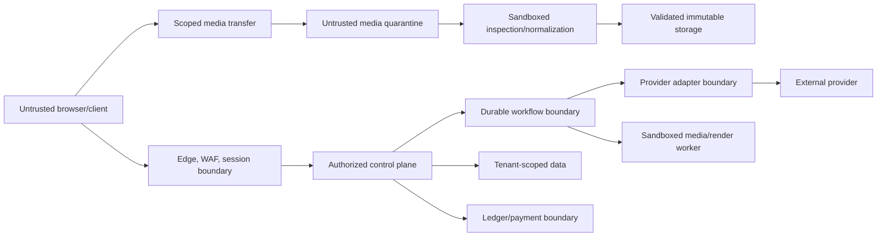

# Security, Privacy, Trust, and Safety

**Status:** Launch security baseline and threat model  
**Version:** 1.0  
**Last updated:** 2026-07-06  
**Policy posture:** Commercial-safe mature content; private projects; no training without separate opt-in

## 1. Objectives

1. Prevent one workspace, user, worker, or provider from accessing another workspace's content.
2. Preserve the confidentiality and integrity of scripts, references, media, story canon, and unreleased cuts.
3. Prevent malicious media and URLs from reaching privileged networks or vulnerable parsers.
4. Make every privileged, billable, destructive, or publishing action attributable.
5. Reduce abuse involving likeness, voice, sexual exploitation, deception, and illegal content.
6. Keep provider data use consistent with customer promises and workspace policy.
7. Recover from compromise without losing the evidence needed to understand it.

Security controls are release requirements, not enterprise add-ons.

## 2. Security model and trust boundaries

Anything received from a browser, media file, script, model, provider callback, webhook, template, or export is untrusted until validated for its destination.

## 3. Data classification

| Class | Examples | Baseline handling |
|---|---|---|
| Public | Published templates, public help | Integrity controls; safe for CDN |
| Internal | Product configuration, aggregate metrics | Employee need-to-know |
| Customer confidential | Scripts, prompts, references, cuts, comments | Tenant isolation, encryption, restricted logs, controlled providers |
| Highly sensitive | Private likeness/voice samples, unreleased IP, legal documents | Explicit rights metadata, stricter access/audit, approved providers only |
| Security secret | Provider credentials, signing keys, session secrets | Secret Manager/KMS, workload access only, rotation |
| Regulated/illegal suspected | Abuse evidence, reports, preservation material | Isolated case system, minimal access, legal procedure, no ordinary product tooling |

Raw customer content must not appear in metric labels, tracing attributes, crash reports, support screenshots, or analytics payloads.

## 4. Identity, authentication, and authorization

### Authentication

- Managed OIDC authentication with verified email and secure account-recovery flows.
- MFA required for CineForge production administrators and workspace owners before high-risk actions; support passkeys where available.
- Short-lived access tokens, rotating refresh tokens, secure/httpOnly/same-site cookies for browser sessions, and CSRF protection.
- Detect new-device, impossible-travel, credential-stuffing, and session-theft indicators with risk-based challenge and notification.
- Reauthentication for payment changes, provider policy changes, ownership transfer, deletion, export of all data, and credential/security changes.

### Workspace RBAC

| Capability | Owner | Admin | Editor | Reviewer | Viewer |
|---|---:|---:|---:|---:|---:|
| Manage ownership/billing | Yes | Limited | No | No | No |
| Manage members/policy | Yes | Yes | No | No | No |
| Publish canon | Yes | Configurable | Configurable | No | No |
| Edit project/canvas/timeline | Yes | Yes | Yes | No | No |
| Generate/spend | Yes | Policy | Policy | No | No |
| Approve take/cut | Yes | Yes | Configurable | Configurable | No |
| Comment/review | Yes | Yes | Yes | Yes | No/comment by policy |
| View | Yes | Yes | Yes | Yes | Yes |

Authorization is checked on every request and object, not inferred from possession of an ID. All tenant-owned database and storage access is workspace-scoped. High-risk tables use PostgreSQL RLS as defense in depth.

### Service identity

- One service account per deployable/worker class; no shared “backend” super-account.
- Workload Identity instead of exported service-account keys.
- Provider credentials scoped per environment/provider and retrieved at runtime.
- Human administrators use separate privileged identities and just-in-time elevation.
- Break-glass access requires approval, reason, short expiry, recording, and post-event review.

## 5. Threat model

Priority reflects pre-control risk.

| ID | Threat | STRIDE | Priority | Required controls |
|---|---|---|---:|---|
| T01 | Cross-workspace object ID substitution | Spoofing/Disclosure | Critical | Object authorization, workspace-scoped repositories, RLS, negative tests |
| T02 | Signed media URL leakage/replay | Disclosure | High | Short TTL, exact object/method, content constraints, no list permission, revoke by object generation |
| T03 | Malicious image/video/audio exploits parser | Tampering/Elevation | Critical | Quarantine, sandbox, patched minimal images, limits, normalize, no host mounts |
| T04 | User URL causes SSRF or metadata access | Disclosure/Elevation | Critical | No arbitrary worker fetch, import proxy, DNS/IP validation, egress allowlists, redirect revalidation |
| T05 | Prompt/document injects instructions into privileged logic | Elevation/Tampering | High | Separate data/system instructions, schema-constrained outputs, no model authority, approval gates |
| T06 | Forged/duplicate provider callback | Spoofing/Tampering | High | Signature verification, timestamp/replay window, job correlation, idempotent state transition |
| T07 | Provider or dependency compromise | Disclosure/Tampering | Critical | Approved register, data minimization, adapter isolation, pinned dependencies, circuit kill switch |
| T08 | Account takeover deletes or exports unreleased project | Spoofing/Impact | Critical | MFA/risk controls, reauth, notifications, soft-delete/recovery, audit |
| T09 | Billing replay/free generation/credit creation | Tampering/Repudiation | High | Append-only double-entry ledger, idempotency, server price, reconciliation, privilege separation |
| T10 | Resource exhaustion via uploads, batches, renders | DoS | High | Size/cardinality quotas, reservation, fair queues, WAF/rate limits, backpressure |
| T11 | CRDT update grants access or corrupts project | Tampering | High | Separate authorization/domain commands, update limits, schema/reference validation, checkpoints |
| T12 | Insider reads customer media | Disclosure | Critical | Least privilege, JIT support access, content access audit, masking, alerts, sanctions |
| T13 | Secret exfiltration through logs/errors/build | Disclosure | Critical | Secret Manager, redaction, scanning, workload identity, protected CI, rotation |
| T14 | Template/subgraph smuggles executable or secret content | Elevation/Disclosure | High | Declarative signed registry, schema validation, no scripts/secrets/URLs |
| T15 | Deepfake, voice clone, or deceptive likeness abuse | Harm | Critical | Consent declarations, moderation, limits, provenance, reports, escalation |
| T16 | Prohibited sexual/child exploitative content | Harm/Legal | Critical | Layered detection, strict policy, reporting/escalation procedure, evidence isolation |
| T17 | Model output leaks other-customer/provider training data | Disclosure | High | Provider diligence, no cross-tenant context, output reporting, provider incident path |
| T18 | Export strips or falsifies provenance | Repudiation | Medium | Signed internal manifest, C2PA-ready claim, disclose limits, preserve source lineage |
| T19 | Supply-chain artifact replaced | Tampering/Elevation | Critical | Protected CI, pinned dependencies, SBOM, signing/verification, isolated builders |
| T20 | Deletion misses derived copies/backups/providers | Disclosure/Privacy | High | Data inventory, lineage-based deletion, provider deletion contract, backup expiry verification |

## 6. Application and API security

- Follow OWASP ASVS and API Security Top 10 as verification baselines, especially object authorization, authentication, resource consumption, SSRF, inventory, and unsafe API consumption.
- Validate body, query, header, file, and structured output against explicit schemas and limits.
- Mutations require idempotency keys and optimistic version conditions where replay or lost updates matter.
- CORS is explicit; CSP uses nonces/hashes and restricts media/connect origins.
- Escape untrusted text by output context; sanitize supported rich text and SVG or rasterize SVG in a sandbox.
- Never place credentials, signed URLs, or customer content in browser-readable build configuration.
- Rate limits combine IP, account, workspace, route, and business-flow dimensions.
- Graph fan-out, upload size, decompressed dimensions, media duration, render complexity, and comment/update rate have server-side limits.
- Webhooks are signed, timestamped, replay-protected, idempotent, and observed.
- Maintain a complete API and callback inventory; undeclared endpoints fail deployment policy.

## 7. Media-ingestion and rendering security

### Upload

1. API authorizes an expected object, content class, maximum size, and checksum option.
2. Browser uploads directly to quarantine through a scoped signed request.
3. Completion event does not mark the asset usable.
4. Inspector validates magic bytes, container, stream count, dimensions, duration, frame rate, sample rate, archive depth, and decompression ratio.
5. Malware scanning and policy screening run.
6. Media is decoded/normalized in a restricted sandbox.
7. Validated original moves/copies into immutable storage and receives an `AssetVersion`.

### Sandbox

- Non-root, read-only root filesystem, no Docker socket, no host mounts.
- Minimal Linux/container and patched FFmpeg/image libraries.
- CPU, memory, process, disk, output, and wall-time limits.
- No general internet egress and no access to metadata services.
- Per-job scratch storage destroyed after completion.
- Separate service identity can read only named inputs and write only the assigned output prefix.
- Treat fonts, LUTs, subtitle files, project archives, and 3D assets as untrusted inputs too.

### URLs and SSRF

The product does not let graph/render workers fetch user-provided URLs. An import service:

- Allows only HTTP(S) where the product supports URL import.
- Resolves and blocks loopback, link-local, RFC1918, metadata, multicast, and internal ranges for IPv4/IPv6.
- Rechecks every redirect and DNS resolution.
- Applies destination allow/deny policy, size/time limits, and content validation.
- Stores the response in quarantine before any parser consumes it.

## 8. Generative AI and prompt-injection controls

- Delimit system instructions, product policy, canon facts, user prompt, source script, and retrieved content as separate typed sections.
- Treat instructions inside uploaded scripts, web imports, metadata, subtitles, and model output as data.
- Models cannot call provider adapters, spend credits, publish canon, alter permissions, access arbitrary assets, or approve work directly.
- Tool actions use allowlisted schemas and server authorization; never execute model-produced shell/code.
- Structured extraction validates schema, source spans, length, and entity references before storing a draft.
- High-impact actions require deterministic checks and, where specified, human confirmation.
- Prompt and output logging follows data classification; safety/debug access is audited and minimized.
- Evaluate jailbreaks, cross-project retrieval, data exfiltration, policy evasion, and misleading confidence before release.

## 9. Provider security and governance

### Approved-provider register

For every provider and capability record:

- Contracting entity and DPA status.
- Data retention and deletion behavior.
- Whether inputs/outputs are used for training or human review.
- Subprocessors and supported regions.
- Encryption, access control, audit, incident-notification, and certification evidence.
- Content policy, safety controls, appeal path, and prohibited uses.
- Rights/commercial-use terms and output provenance behavior.
- API authentication, callback verification, quotas, and deprecation policy.
- Approved CineForge data classes and workspace tiers.
- Owner, review date, exceptions, and kill-switch procedure.

No adapter is production-enabled only because it passes technical tests. Legal, privacy, security, safety, finance, and product approval are required.

### Runtime controls

- Send only the minimum inputs required for the selected capability.
- Check provider/data-class/workspace policy before staging assets.
- Use isolated credentials and egress policy per provider.
- Encrypt credentials with KMS-backed Secret Manager; pin versions in deployment configuration and rotate.
- Apply circuit breakers for failure, policy incident, suspicious output, cost anomaly, and contract suspension.
- Copy outputs into CineForge-controlled storage promptly; provider URLs are temporary transport details.

## 10. Content safety and abuse prevention

### Launch policy

Allow mature dramatic themes and non-graphic cinematic violence. Prohibit at minimum:

- Child sexual abuse or sexualization of minors.
- Non-consensual intimate content and sexual exploitation.
- Explicit sexual content at launch.
- Instructions or media facilitating severe wrongdoing where policy/law requires restriction.
- Terrorist/extremist propaganda as defined by policy, while preserving carefully governed documentary context.
- Fraudulent impersonation, abusive political/public-figure deception, or deceptive likeness use.
- Voice/likeness cloning without adequate rights and consent.

The detailed policy must be reviewed by qualified counsel and trust-and-safety leadership for launch jurisdictions. This document is a product baseline, not legal advice.

### Layered enforcement

- Account and payment abuse signals.
- Prompt/reference precheck.
- Provider safety controls at the approved setting.
- Output classification before user delivery.
- Rate and capability limits for higher-risk operations.
- Rights/consent declarations and evidence references for likeness/voice features.
- User reporting, appeal, repeat-offender, and emergency escalation processes.
- Hash matching/reporting obligations implemented only through vetted vendors and counsel-defined procedures.

### Human review

- Reviewers see only case-minimal content and receive specialized training.
- Highly sensitive evidence is isolated from ordinary support/admin surfaces.
- Every access and action is logged; exports are controlled.
- Retention follows legal/policy purpose and is not extended casually.
- Wellness and exposure-reduction practices are part of operational design.

## 11. Privacy

### Commitments

- Private by default.
- No CineForge or provider training on customer content without a separate, explicit, revocable opt-in and compatible provider path.
- Purpose limitation and data minimization.
- Transparent provider disclosure and material-change notice.
- Workspace export, correction, and deletion workflows.
- No sale of customer scripts, prompts, references, or media.

### Retention

Define and publish periods for active projects, trash/recovery, temporary transfers, abandoned uploads, proxies, exports, logs, audit records, billing records, abuse evidence, and backups. Deletion uses lineage to cover originals, derivatives, indexes, collaboration snapshots, cached exports, and provider copies. Backups expire on a documented schedule; they are not selectively rewritten unless required and technically supported.

### Residency

Initial global service uses a disclosed primary US region. An EU option requires a complete regional data plane, not a UI flag: database, buckets, encryption keys, collaboration, workflows, logs, approved provider routes, support procedure, and deletion evidence.

### Data subject and workspace requests

- Verify requester identity and authority.
- Export in usable formats with a manifest.
- Record request, scope, systems searched, exceptions, completion, and provider actions.
- Separate project deletion from account, workspace, and statutory billing/audit retention.

## 12. Encryption and key management

- TLS for all external and service communication; modern secure configurations.
- GCP encryption at rest by default, with CMEK for selected high-sensitivity stores where threat/compliance analysis justifies operational cost.
- KMS separation by environment and purpose; signing keys separate from data-encryption keys.
- Secret Manager with least-privilege secret-level access, access logging, pinned versions, rotation, and disable-before-destroy.
- C2PA signing keys held in KMS/HSM-backed service where compatible; signing service has no broad asset read access.
- Passwords, if any, use a modern memory-hard password hash through the identity provider.

## 13. Provenance and authenticity

Internal lineage is authoritative for CineForge operations. It records parent asset versions, runs, transformations, canon/capability snapshots, actors, approvals, and exports.

For external media:

- Generate a human-readable production report.
- Implement C2PA Content Credentials where target formats/tooling allow.
- Sign claims through a controlled claim-generator service.
- Preserve ingredient manifests when licensed and technically possible.
- Clearly state that provenance demonstrates recorded origin/history and tamper evidence; it does not prove that depicted events are true.
- Never encode private prompts, collaborator identities, or sensitive project facts into a public manifest by default.

Reference: [C2PA specifications](https://spec.c2pa.org/specifications/).

## 14. Logging, audit, and detection

### Audit events

Record login/security changes, membership/role changes, support access, canon publication, approvals, provider-policy changes, generation authorization, budget overrides, ledger adjustments, exports/shares, rights declarations, deletion, and provenance signing.

Audit records include actor, effective identity, workspace, action, target/version, decision, source context, timestamp, and correlation ID. They exclude raw secrets and minimize customer content.

### Detection

- Cross-workspace authorization failures and enumeration patterns.
- Abnormal export/download volume.
- Provider callback signature/replay failures.
- Secret access anomalies.
- Privilege and workspace ownership changes.
- Repeated safety evasion and high-risk capability bursts.
- Credit/ledger/provider reconciliation anomalies.
- Unusual support/admin content access.
- Malware and parser crash clusters.

Alerts have owners, severity, runbook, evidence source, and test schedule.

## 15. Secure development and supply chain

- Threat modeling for new data flows and high-risk features.
- Code review, branch protection, signed commits/tags where operationally supported.
- SAST, dependency, secret, IaC, and container scanning.
- Pinned dependencies and reviewed lockfile changes.
- Isolated CI builders using Workload Identity Federation; no long-lived cloud keys.
- SBOM and signed container/artifact provenance.
- Deploy-time signature verification and environment policy.
- Regular patch cadence with expedited critical vulnerability process.
- External penetration test before paid GA and after major trust-boundary changes.
- Coordinated vulnerability disclosure and security contact.

## 16. Incident response

Phases:

1. **Detect and triage:** establish severity, affected tenants/data/providers, and legal clocks.
2. **Contain:** revoke sessions/credentials, disable adapter/capability, isolate worker, block share links, preserve evidence.
3. **Eradicate and recover:** patch, rotate, validate data integrity, restore service gradually.
4. **Notify:** customers, providers, regulators, payment partners, or authorities according to confirmed obligations.
5. **Learn:** blameless review, control changes, customer remediation, tracked completion.

Required exercises: account takeover, cross-tenant exposure, provider breach, malicious file/parser compromise, signing-key compromise, billing fraud, prohibited-content escalation, and destructive insider action.

## 17. Compliance roadmap

The launch baseline is designed to support—not claim—future assurance:

- SOC 2-aligned control ownership, evidence, access review, change management, incident response, vendor management, backup tests.
- GDPR-capable records, legal basis, DPA/subprocessor transparency, data-subject operations, transfer analysis, and privacy-by-design.
- NIST AI RMF and Generative AI Profile for govern/map/measure/manage activities.
- OWASP ASVS/API verification for application security.
- C2PA for opt-in media provenance.

Certification, jurisdictional availability, age eligibility, copyright, biometric/voice, political-content, and mandatory-reporting positions require counsel and formal company policy before launch.

## 18. Verification gates

### Before private beta

- Tenant isolation tests at API, database, collaboration, storage, worker, and export boundaries.
- Threat model review for upload, generation, collaboration, billing, and share links.
- Provider register complete for every enabled capability.
- Malware/parser sandbox and SSRF tests.
- Secret rotation and production access review.
- Abuse reporting and escalation runbook exercised.

### Before paid GA

- No open critical/high security findings without executive risk acceptance and expiry.
- External penetration test completed and remediated.
- Account takeover, provider disable, data export/deletion, backup restore, and breach-response exercises passed.
- Ledger manipulation/replay and webhook tests passed.
- C2PA claims avoid sensitive data and validate in supported tools.
- Privacy notices, terms, content policy, provider disclosures, and internal procedures agree with actual behavior.

## 19. Primary references

- [OWASP API Security Top 10](https://owasp.org/API-Security/editions/2023/en/0x00-header/)
- [NIST AI Risk Management Framework](https://www.nist.gov/itl/ai-risk-management-framework)
- [NIST Generative AI Profile](https://nvlpubs.nist.gov/nistpubs/ai/NIST.AI.600-1.pdf)
- [Google Secret Manager best practices](https://docs.cloud.google.com/secret-manager/docs/best-practices)
- [Google VPC Service Controls](https://docs.cloud.google.com/vpc-service-controls/docs/overview)
- [Google Cloud Armor best practices](https://docs.cloud.google.com/armor/docs/best-practices)
- [C2PA specifications](https://spec.c2pa.org/specifications/)
