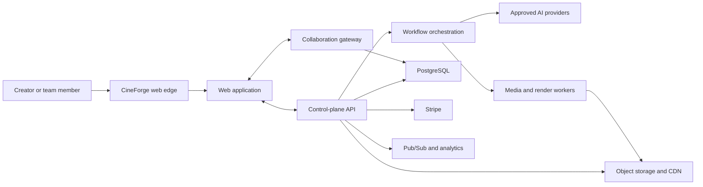
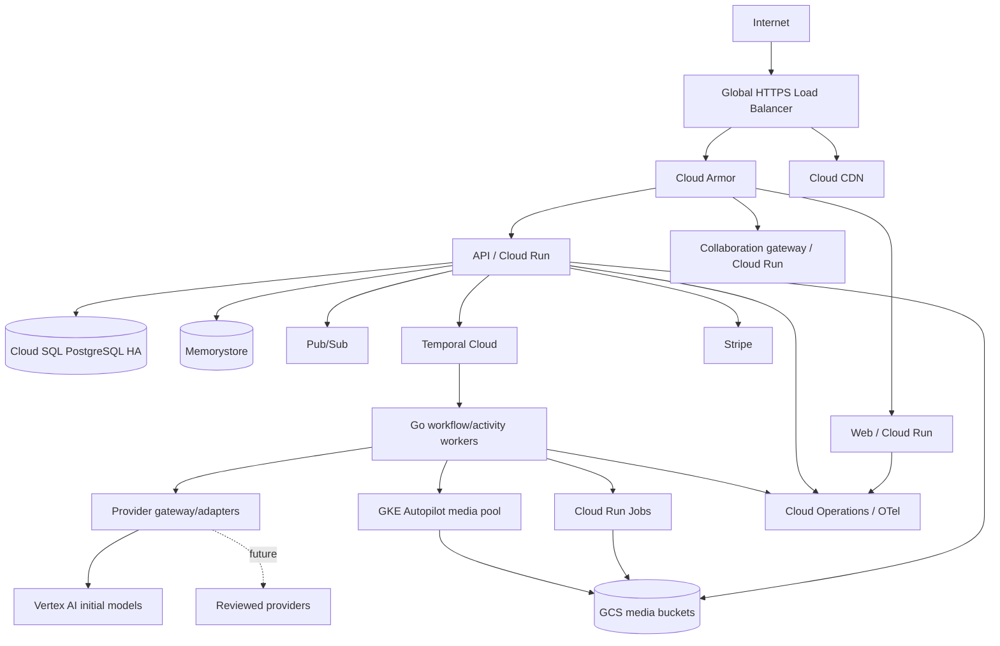
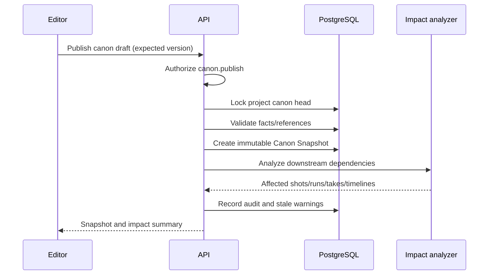

# CineForge Technical System Design

**Status:** Target architecture  
**Version:** 1.0  
**Last updated:** 2026-07-06  
**Capacity envelope:** 10,000 MAU, approximately 1,000 simultaneous editing sessions

## 1. Architecture goals

- Keep interactive editing responsive while generation and rendering run asynchronously.
- Preserve an immutable explanation of every generated or rendered asset.
- Add providers without changing product data or canvas behavior.
- Isolate workspaces, contain untrusted media, and make spend auditable.
- Scale the control plane independently from media transfer and compute.
- Use managed services until workload economics justify dedicated infrastructure.
- Avoid a microservice fleet before operational boundaries require it.

## 2. Recommended stack

| Layer | Choice | Rationale |
|---|---|---|
| Web application | Next.js, React, TypeScript | Mature product ecosystem, SSR where useful, shared UI/types |
| Graph UI | XYFlow initially | Fast path to accessible node interaction; isolate behind a graph-view adapter |
| Heavy canvas rendering | WebGL/WebGPU layer as needed | Avoid DOM scaling ceiling without rewriting product state |
| Client state | Normalized store plus query cache | Separate ephemeral UI state from server/project state |
| Collaboration | Yjs CRDT, dedicated collaboration gateway | Proven concurrent shared types; product-owned persistence and authorization |
| NLE preview | WebCodecs, WebGL/WebGPU, AudioWorklet | Low-latency proxy decode, compositing, and audio in supported browsers |
| Offline/cache | IndexedDB and OPFS | Proxy, thumbnail, waveform, and operation caching |
| Core backend | Go modular services | Strong concurrency, predictable resource use, static deployment, good Temporal support |
| Durable workflows | Temporal Cloud with Go workers | Resumable long-running orchestration and deterministic event history |
| Transactional data | Cloud SQL for PostgreSQL + pgvector | Relational integrity, RLS option, JSONB flexibility, semantic search |
| Object storage | Google Cloud Storage | Immutable media, lifecycle rules, signed access, regional controls |
| Event fan-out | Pub/Sub | Decouple state changes from notifications, analytics, and derived work |
| Cache/rate limiting | Memorystore for Redis | Ephemeral cache, presence support, quotas; never system of record |
| Media processing | FFmpeg in sandboxed workers | Broad codec/filter support and deterministic render primitives |
| Runtime | Cloud Run and Cloud Run Jobs | Managed scaling for API, adapters, and bounded jobs |
| Heavy media runtime | GKE Autopilot when triggered | Long-running/specialized workers, predictable pools, future GPU needs |
| Edge/security | Global load balancer, Cloud Armor, CDN | DDoS/WAF controls, media delivery, origin protection |
| Identity | Identity Platform/OIDC | Managed authentication; CineForge retains workspace authorization |
| Billing | Stripe + internal ledger | Subscription/payment primitives with product-owned usage truth |
| Observability | OpenTelemetry + Cloud Operations | Correlated traces, logs, metrics, and SLOs |
| Infrastructure | Terraform | Reviewable, repeatable environments and policy controls |

### Why Go, not a system-language rewrite everywhere

Generation is mostly network and workflow orchestration; rendering is performed by FFmpeg. Go gives efficient concurrency and deployment without making media algorithms bespoke. Rust is justified later for a desktop shell, codec-sensitive local engine, or a measured hot path—not as a launch requirement. Python is reserved for evaluation, data science, and future custom ML where its ecosystem provides direct value.

## 3. Context diagram



## 4. Logical architecture

Start as a small number of deployable units with strict modules. Split only on independent scale, security, or availability needs.

### 4.1 Web client

- Shell, routing, authentication, workspace/project navigation.
- Develop/Story World editor.
- Canvas and node inspector.
- Asset library and review UI.
- Timeline, monitor, mixer, caption editor.
- Local proxy cache and background upload/download manager.
- Collaboration provider and presence.
- Client telemetry with privacy filtering.

The client is never authoritative for permissions, price, run state, asset ownership, or final render.

### 4.2 Control-plane API

Modules:

- Identity/session and workspace authorization.
- Projects, Story World, canon, scenes, shots, and takes.
- Graph definitions, validation, and run planning.
- Asset metadata and signed-transfer authorization.
- Timeline versions and render requests.
- Reviews, comments, approvals, notifications.
- Provider catalog and workspace policy.
- Usage ledger, budgets, entitlements, and Stripe integration.
- Audit, export, retention, and deletion.

Use REST/JSON externally for broad tooling compatibility and generated typed clients. Internal high-volume services may use Connect/gRPC. Mutations accept an idempotency key and optimistic version precondition.

### 4.3 Collaboration gateway

- Authenticates a short-lived project collaboration token.
- Authorizes document/channel access against the control plane.
- Hosts Yjs documents for canvas presentation, text editing, and timeline operations.
- Persists incremental updates and periodic compacted snapshots.
- Broadcasts presence separately from durable document state.
- Enforces document-size, update-rate, and awareness-payload limits.

Domain decisions such as canon publication, approval, billing, and provider execution remain API commands. CRDT updates cannot grant permissions or trigger spend directly.

### 4.4 Workflow and provider plane

- Graph planner resolves immutable inputs and computes an execution plan.
- Ledger reserves budget.
- Temporal workflow coordinates provider adapter activities, callback/poll, ingestion, derived media, and settlement.
- Provider gateway applies capability mapping, policy, credentials, quotas, and circuit breakers.
- Ingestion validates and stores output before creating asset metadata.

### 4.5 Media plane

Distinct worker classes:

- Inspect/normalize uploads.
- Generate thumbnails, waveforms, and proxies.
- Deterministic image/audio transforms.
- Timeline render and export packaging.
- Interchange import/export.
- Provenance manifest and Content Credential creation.

Workers receive one-time job claims and internal asset IDs. They do not accept arbitrary input URLs or broad bucket credentials.

## 5. Deployment topology



### Environment separation

- Separate GCP projects for production, staging, development, security/logging, and CI artifacts.
- Separate databases, buckets, keys, service accounts, provider credentials, Temporal namespaces, and Stripe modes.
- No production customer content in lower environments. Sanitized fixtures only.
- Infrastructure changes require plan review and policy checks.

## 6. Data architecture

### 6.1 PostgreSQL ownership

PostgreSQL is authoritative for identity mappings, workspace/project metadata, Story World, graph/timeline versions, runs, approvals, asset metadata, provider catalog snapshots, ledger entries, and audit records.

Representative tables:

- `users`, `workspaces`, `memberships`, `workspace_policies`
- `projects`, `project_versions`, `story_sources`
- `entities`, `entity_versions`, `canon_facts`, `canon_snapshots`, `canon_snapshot_items`
- `scenes`, `scene_versions`, `shots`, `shot_versions`, `takes`
- `graphs`, `graph_versions`, `node_instances`, `edges`, `node_definitions`
- `runs`, `run_attempts`, `run_inputs`, `run_events`, `provider_capability_snapshots`
- `assets`, `asset_versions`, `asset_lineage`, `rights_declarations`, `policy_decisions`
- `timelines`, `timeline_versions`, `render_jobs`
- `comments`, `review_requests`, `approvals`, `audit_events`
- `accounts`, `ledger_entries`, `reservations`, `price_books`, `provider_usage`

Every tenant-owned row carries `workspace_id`. Repository methods require workspace scope. PostgreSQL RLS provides defense in depth for high-risk tables, with transaction-local workspace context set by the API.

### 6.2 Object storage

Bucket classes:

- Quarantine uploads.
- Immutable originals/provider outputs.
- Derived proxies/thumbnails/waveforms.
- Render outputs and export packages.
- Temporary transfer objects with aggressive lifecycle deletion.
- Audit/compliance exports with separate retention.

Object names use opaque IDs; user filenames are metadata. Public ACLs are prohibited. Upload/download use short-lived signed operations restricted by object, method, content length/type, and purpose.

### 6.3 CRDT persistence

- Append Yjs updates to a durable update log with workspace/project/document identity.
- Compact into snapshots by size/update count/time threshold.
- Store a server sequence and state vector for recovery.
- Retain product-level named checkpoints independently from CRDT compaction.
- Validate that restored documents reference authorized domain object IDs.

### 6.4 Search

PostgreSQL full-text and pgvector are sufficient initially for Story World and authorized asset metadata. Generate embeddings asynchronously and retain embedding-model version. Do not embed raw restricted content with a provider whose policy is not approved for that data class.

### 6.5 Analytics

Product analytics receives pseudonymous event IDs and product metadata, not prompts, scripts, media URLs, access tokens, or raw comments. Usage/accounting comes from the ledger and operational database, not client analytics.

## 7. Key flows

### 7.1 Canon publication



Publication never rewrites a prior snapshot. Downstream items may be marked stale, but remain readable.

### 7.2 Generation run

```mermaid
sequenceDiagram
  participant U as User
  participant API as Control API
  participant L as Ledger
  participant T as Temporal
  participant P as Provider adapter
  participant S as Asset ingestion

  U->>API: Plan selected node(s)
  API->>API: Resolve graph, canon, assets, capability, policy
  API-->>U: Estimate and execution plan
  U->>API: Authorize plan
  API->>L: Reserve maximum amount
  L-->>API: Reservation
  API->>T: Start run with immutable snapshot
  T->>P: Submit normalized request
  P-->>T: Provider job reference
  T->>P: Poll or receive verified callback
  P-->>T: Output references and usage
  T->>S: Ingest, scan, moderate, checksum, store
  S-->>T: AssetVersion IDs
  T->>L: Settle actual amount; release remainder
  T-->>API: Terminal run event
  API-->>U: Result and actual cost
```

### 7.3 Collaborative timeline edit

1. The client authenticates and loads a compacted timeline document plus updates.
2. Timeline operations use stable clip IDs and rational times.
3. CRDT updates replicate; clip soft locks and presence reduce conflicting gestures.
4. Server validates size/rate and persists updates.
5. Domain commands—approve cut, request render, replace approved take—capture a canonical `TimelineVersion` transactionally.
6. Render reads only that immutable version.

### 7.4 Render

1. Validate timeline, media availability, effect support, rights, and policy.
2. Build a content-addressed render manifest and estimate compute/egress.
3. Reserve cost and choose worker class.
4. Render segments with deterministic FFmpeg commands and pinned container/effect versions.
5. Reuse verified unchanged segments.
6. Assemble, QC, add captions/stems/provenance, and ingest results.
7. Settle usage and publish export package.

## 8. Full NLE design

### Browser preview

- Use low-bitrate intraframe or short-GOP proxies selected by capability detection.
- Decode with WebCodecs where supported; maintain a fallback path for ordinary HTML media playback in read/review mode.
- Render visual layers through WebGL/WebGPU and audio through Web Audio/AudioWorklet.
- Generate waveform and thumbnail tiles server-side; cache locally.
- Use a scheduling window around the playhead and cancel stale decode requests during scrubbing.
- Target frame-accurate editing for supported proxy formats; show when source codec limitations degrade precision.

### Timeline model

- Rational project timebase and explicit media/source time ranges.
- Stable IDs for tracks, clips, effects, keyframes, transitions, markers, captions, and nested sequences.
- Operations are semantic (`trimClip`, `rippleDelete`, `replaceTake`) rather than raw document mutations.
- Undo/redo is per-user intent over collaborative state; an undo never invisibly removes another user's later work.
- Replacement takes preserve the shot link, destination duration policy, comments, and markers; mismatch resolution is explicit.

### Cloud render

- Render manifest captures timeline version, source checksums, effects and versions, font/LUT assets, codecs, color configuration, and output preset.
- Unsupported preview-only effects block final render with an actionable report.
- Segment cache keys include every rendering influence.
- Output QC checks duration, streams, silence/black-frame thresholds where appropriate, caption presence, and checksum.

### Interchange

- OTIO is the canonical interchange target for cut structure; it references external media rather than embedding it.
- FCPXML and EDL are lossy adapters with a pre-export compatibility report.
- Export package includes originals/proxies as selected, stems, LUTs/fonts where licensable, captions, a relink manifest, and human-readable warnings.

## 9. Multi-provider architecture

### Catalog

The product reads a CineForge capability catalog. A stable alias points to an immutable capability snapshot including modality, operations, limits, pricing version, lifecycle, regions, data policy, and provider extensions.

### Adapter isolation

- One logical adapter package per provider, deployed separately when security or dependency isolation warrants it.
- Credentials retrieved at runtime through workload identity and Secret Manager.
- Per-provider egress allowlist, quotas, circuit breaker, concurrency, timeout, and telemetry.
- Request contains staged signed asset access valid only for the provider operation where the provider supports pull input; prefer controlled upload where possible.
- Provider output is copied immediately into CineForge storage after validation.

### Routing

Routing filters in order:

1. Workspace/provider permission and region/data class.
2. Required capability and parameter compatibility.
3. Provider lifecycle and operational health.
4. User's explicit selection or approved recommendation policy.
5. Cost/quality/speed objective.

Fallback requires prior workspace authorization and remains a separate recorded take. Never relabel one provider's output as another model.

## 10. Billing architecture

- Stripe owns payment instruments, subscription invoice mechanics, and tax integrations.
- CineForge owns entitlements, price books, reservations, usage, credits, refunds, and project/member allocation.
- Amounts use integer micros; provider-native units are retained separately.
- Price book is versioned and captured in the reservation.
- Ledger posts balanced entries for reserve, settle, release, refund, and manual adjustment.
- A reconciliation worker compares provider usage, terminal runs, ledger entries, and Stripe usage/invoices.
- Unreconciled or negative-margin anomalies page operations before invoicing where possible.

## 11. Scaling plan

### Baseline year-one assumptions

- 10,000 MAU, 1,000 simultaneous editing/review sessions.
- Traffic is bursty around generations and team review.
- Media bandwidth and storage dominate API compute.
- Provider quotas, not CPU, may be the first generation bottleneck.

### Techniques

- Stateless API instances and connection-aware collaboration autoscaling.
- Connection draining and document reassignment for collaboration deploys.
- Database connection pooling and bounded Cloud Run concurrency.
- Partition/archival plan for run events, audit events, and ledger entries by time/workspace.
- Pub/Sub consumers with idempotent handlers and dead-letter topics.
- Backpressure at run planning and reservation before provider submission.
- Per-workspace fair queues to prevent one production from starving others.
- Direct authorized media transfer, never proxy large files through API instances.
- Lifecycle transitions for abandoned proxies and exports; originals follow project retention.

### Scale triggers

- Move Cloud SQL to AlloyDB after measured write/read or replica requirements exceed Cloud SQL economics/capacity—not on a calendar date.
- Move a media worker class to GKE when job duration, concurrency, hardware, startup latency, or unit cost is consistently unsuitable for Cloud Run Jobs.
- Split the modular API only when a module needs independent scaling, fault containment, or restricted administration.
- Add an EU data plane when residency demand justifies a complete boundary for database, buckets, keys, workflows, and approved providers.

## 12. Reliability and disaster recovery

- Multi-zone Cloud SQL HA, automated backups, PITR, and quarterly restore exercises.
- Object versioning/retention appropriate to bucket class; replication policy based on RPO and cost.
- Temporal Cloud namespace retention and worker redeployability from pinned artifacts.
- Terraform recreation of infrastructure and documented dependency bootstrap order.
- Graceful degraded modes: view/download existing work when providers are down; edit locally when generation is paused; queue renders within capacity limits.
- Primary-region launch target: database RPO ≤ 5 minutes and service RTO ≤ 60 minutes for a severe control-plane incident; object durability follows configured GCS class. These are design targets validated by exercises.
- Regional disaster response initially restores in a pre-approved secondary US region. It is not active-active.

## 13. Observability

### Signals

- API request latency/error by route class.
- Collaboration connect, sync, update latency, document size, and disconnect rate.
- Temporal workflow age, task queue depth, retry, and stuck state.
- Provider submission/success/rejection/timeout/cancellation by capability.
- Media queue age, render factor, failure, and cache hit.
- Database saturation, locks, replication/backup health.
- Signed-transfer failures and CDN throughput.
- Ledger variance, budget blocks, provider cost, gross margin.

Use OpenTelemetry trace context through API, workflow, activity, provider adapter, ingestion, and ledger. Do not place customer content in spans or metric labels.

## 14. Delivery and deployment

- Trunk-based development with protected main and short-lived branches.
- CI: unit, schema, adapter contract, security, migration, and deterministic render tests.
- Build signed SBOM-producing container artifacts in an isolated project.
- Progressive deployment: staging → internal canary → production canary → full.
- Database changes use expand/migrate/contract and remain backward compatible across one deploy window.
- Temporal workflow changes use versioning/patching compatible with historical event replay.
- Provider capability catalog changes are reviewed data deployments with automated validation.
- Feature flags are workspace-scoped and have owner, expiry, and rollback behavior.

## 15. Build versus buy decisions

### Build

- Story World/canon and continuity model.
- Graph planner and immutable run evidence.
- Provider-normalization contract and conformance suite.
- Asset lineage, take/approval semantics, and editorial conform.
- Usage ledger and production-aware cost views.
- Timeline state and deterministic render manifest.

### Buy or adopt

- Foundation models and initial media generation.
- Temporal Cloud, Stripe, managed PostgreSQL, object storage, identity primitives.
- Yjs protocol/data structures, FFmpeg, OTIO, OpenTelemetry.

### Re-evaluate later

- Managed collaboration vendor versus operating the gateway.
- Custom media engine/desktop shell.
- Dedicated render cluster or spot capacity.
- Proprietary consistency/evaluation models.

## 16. Architecture acceptance tests

- Cross-workspace ID substitution fails at API, collaboration, storage, and worker boundaries.
- Worker termination at every generation/render phase resumes without duplicate spend or output.
- Duplicate and late provider callbacks converge safely.
- A deprecated model leaves historical runs and graphs readable.
- One collaboration instance loss reconnects clients and restores acknowledged state.
- A new take conforms into a cut without changing unrelated timing.
- Identical render manifests produce equivalent frames/audio within documented codec determinism.
- Database restore and object reconciliation meet RPO/RTO targets.
- Target-load test sustains 1,000 live sessions while generation and render queues apply fair backpressure.

## 17. Architecture references

- [Temporal durable execution](https://docs.temporal.io/temporal)
- [Yjs documentation](https://docs.yjs.dev/)
- [WebCodecs specification](https://w3c.github.io/webcodecs/)
- [OpenTimelineIO](https://opentimelineio.readthedocs.io/en/latest/)
- [Google Cloud VPC Service Controls](https://docs.cloud.google.com/vpc-service-controls/docs/overview)
- [Vertex AI release notes](https://docs.cloud.google.com/vertex-ai/docs/release-notes)
